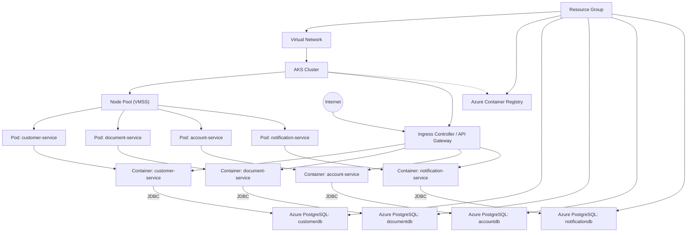

# Bank Account Opening System

This is a microservices-based system for bank account opening, built with Spring Boot and deployed on Azure Kubernetes Service (AKS).

## Architecture

The system consists of the following microservices:

- **Customer Service**: Handles customer information and KYC processes
- **Document Service**: Manages document upload and verification
- **Account Service**: Handles account creation and management
- **Notification Service**: Manages all notifications and communications

## Technology Stack

- Java 17
- Spring Boot 3.x
- Maven
- Azure Kubernetes Service (AKS)
- Terraform for infrastructure

## Project Structure

```
account-opening-system/
├── customer-service/     # Customer management and KYC
├── document-service/     # Document handling
├── account-service/      # Account management
├── notification-service/ # Notifications
└── infrastructure/      # Terraform IaC for AKS
```

## Prerequisites

- Java 17 or higher
- Maven 3.8+
- Docker
- Azure CLI
- Terraform
- Kubernetes CLI (kubectl)

## Building the Project

To build all services:

```bash
mvn clean install
```

## Running Locally

Each service can be run locally using:

```bash
cd <service-name>
mvn spring-boot:run
```

## Deployment

The services are deployed to AKS using Terraform and Kubernetes manifests. See the infrastructure directory for details.

## Azure Architecture Diagram



## AKS Troubleshooting & Solutions

See [aksissues.md](./aksissues.md) for common AKS issues and solutions.
