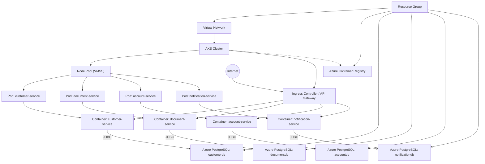

# Bank Account Opening System

This is a microservices-based system for bank account opening, built with Spring Boot and deployed on Azure Kubernetes Service (AKS).

## Architecture

The system consists of the following microservices:

- **Customer Service**: Handles customer information and KYC processes
- **Document Service**: Manages document upload and verification
- **Account Service**: Handles account creation and management
- **Notification Service**: Manages all notifications and communications

## Technology Stack

- Java 17
- Spring Boot 3.x
- Maven
- Azure Kubernetes Service (AKS)
- Terraform for infrastructure

## Project Structure

```
account-opening-system/
├── customer-service/     # Customer management and KYC
├── document-service/     # Document handling
├── account-service/      # Account management
├── notification-service/ # Notifications
└── infrastructure/      # Terraform IaC for AKS
```

## Prerequisites

- Java 17 or higher
- Maven 3.8+
- Docker
- Azure CLI
- Terraform
- Kubernetes CLI (kubectl)

## Building the Project

To build all services:

```bash
mvn clean install
```

## Running Locally

Each service can be run locally using:

```bash
cd <service-name>
mvn spring-boot:run
```

## Deployment

The services are deployed to AKS using Terraform and Kubernetes manifests. See the infrastructure directory for details.

## Deployment Steps

1. **Provision Azure Infrastructure**
   - Edit `dev.tfvars` or `prod.tfvars` with your environment settings.
   - Run Terraform to create resources:
     ```bash
     terraform init
     terraform workspace select dev   # or prod
     terraform apply -var-file="dev.tfvars"   # or prod.tfvars
     ```
   - This will create AKS, ACR, PostgreSQL, VNet, subnets, and all security resources.

2. **Build and Push Microservice Images**
   - Ensure Docker and Maven are installed locally or use the provided GitHub Actions pipeline.
   - Build and push images to Azure Container Registry:
     ```bash
     mvn clean package -DskipTests
     docker build -t <ACR_LOGIN_SERVER>/customer-service:<tag> ./customer-service
     docker build -t <ACR_LOGIN_SERVER>/document-service:<tag> ./document-service
     docker build -t <ACR_LOGIN_SERVER>/account-service:<tag> ./account-service
     docker build -t <ACR_LOGIN_SERVER>/notification-service:<tag> ./notification-service
     docker push <ACR_LOGIN_SERVER>/customer-service:<tag>
     docker push <ACR_LOGIN_SERVER>/document-service:<tag>
     docker push <ACR_LOGIN_SERVER>/account-service:<tag>
     docker push <ACR_LOGIN_SERVER>/notification-service:<tag>
     ```
   - Or let GitHub Actions handle this automatically on push to `main`.

3. **Configure Kubernetes Manifests**
   - Place your deployment and service YAML files in the `k8s/` directory:
     - `customer-service-deployment.yaml`, `customer-service-service.yaml`, etc.
     - Include environment variables for DB connection, ACR image, etc.
     - Optionally add `ingress.yaml` for API Gateway routing.

4. **Deploy to AKS**
   - Use `kubectl` to apply manifests:
     ```bash
     az aks get-credentials --resource-group <resource-group> --name <aks-cluster>
     kubectl apply -f k8s/customer-service-deployment.yaml
     kubectl apply -f k8s/customer-service-service.yaml
     # Repeat for other services
     kubectl apply -f k8s/ingress.yaml   # if using ingress
     ```
   - Or let GitHub Actions deploy automatically via `.github/workflows/aks-deploy.yml`.

5. **Monitor and Troubleshoot**
   - Use Azure Portal, Log Analytics, and `kubectl` to monitor deployments.
   - See [aksissues.md](./aksissues.md) for common AKS issues and solutions.

### Passwordless PostgreSQL Login
- The PostgreSQL Flexible Server is configured for Azure AD authentication (passwordless).
- AKS pods/services should use managed identities and Azure AD tokens to connect securely.
- See [Azure docs](https://learn.microsoft.com/en-us/azure/postgresql/flexible-server/concepts-azure-ad-authentication) for setup and connection details.

## Azure Architecture Diagram



## AKS Troubleshooting & Solutions

See [aksissues.md](./aksissues.md) for common AKS issues and solutions.

## Kubernetes Manifests: Purpose & Creation

Kubernetes manifests are YAML files that define how your microservices are deployed, configured, and exposed in the AKS cluster. They are essential for:
- Declaring deployments, services, ingress, and other resources in a reproducible, version-controlled way.
- Specifying container images, resource limits, environment variables, secrets, and configmaps for each microservice.
- Enabling automated, consistent deployments across environments (dev/prod).

### Why Use Kubernetes Manifests?
- **Declarative Infrastructure**: Manifests allow you to describe the desired state of your application and infrastructure. Kubernetes ensures the cluster matches this state.
- **Portability**: Manifests can be reused across clusters and environments, making it easy to replicate or migrate deployments.
- **Automation**: CI/CD pipelines can apply manifests automatically, enabling rapid, reliable deployments.
- **Security & Configuration**: Secrets, configmaps, and identity settings are managed securely and injected into pods via manifests.

### Creating Manifests for Each Microservice
1. **Create a `k8s/` Directory**
   - Place all manifest files in the `k8s/` directory at the project root.

2. **Write Deployment YAMLs**
   - For each microservice, create a deployment file (e.g., `customer-service-deployment.yaml`).
   - Example:
     ```yaml
     apiVersion: apps/v1
     kind: Deployment
     metadata:
       name: customer-service
     spec:
       replicas: 2
       selector:
         matchLabels:
           app: customer-service
       template:
         metadata:
           labels:
             app: customer-service
         spec:
           containers:
           - name: customer-service
             image: <ACR_LOGIN_SERVER>/customer-service:<tag>
             env:
             - name: SPRING_DATASOURCE_URL
               valueFrom:
                 configMapKeyRef:
                   name: customer-service-config
                   key: db-url
             - name: SPRING_DATASOURCE_USERNAME
               valueFrom:
                 secretKeyRef:
                   name: customer-service-secret
                   key: db-username
             - name: SPRING_DATASOURCE_PASSWORD
               valueFrom:
                 secretKeyRef:
                   name: customer-service-secret
                   key: db-password
     ```

3. **Write Service YAMLs**
   - For each microservice, create a service file (e.g., `customer-service-service.yaml`).
   - Example:
     ```yaml
     apiVersion: v1
     kind: Service
     metadata:
       name: customer-service
     spec:
       selector:
         app: customer-service
       ports:
         - protocol: TCP
           port: 80
           targetPort: 8080
     ```

4. **Add Ingress (Optional)**
   - Create an `ingress.yaml` for API Gateway/routing if needed.

5. **Repeat for All Microservices**
   - Follow the same pattern for document-service, account-service, and notification-service.

## AKS Pod Identity/Workload Identity for Passwordless PostgreSQL

To enable passwordless access to Azure PostgreSQL from AKS pods:
- Use Azure AD authentication and assign a managed identity to your pods via AKS workload identity.
- Update your manifests to reference the identity and configure the JDBC connection to use Azure AD tokens.
- See [Azure docs](https://learn.microsoft.com/en-us/azure/aks/workload-identity-overview) for setup steps.

**Manual Steps or IaC:**
- Create a managed identity in Azure.
- Assign the identity to the AKS node pool or specific pods using annotations in your deployment YAMLs:
  ```yaml
  spec:
    template:
      metadata:
        annotations:
          azure.workload.identity/client-id: <MANAGED_IDENTITY_CLIENT_ID>
  ```
- Grant the identity access to PostgreSQL (via Azure portal or Terraform).
- Configure your Spring Boot app to use Azure AD authentication for JDBC.

## Secrets and ConfigMaps for DB Connection

- **ConfigMaps**: Store non-sensitive configuration (e.g., DB URL).
- **Secrets**: Store sensitive data (e.g., DB username, password, Azure AD token if needed).
- Reference these in your deployment manifests as shown above.
- Create them using kubectl or YAML files:
  ```bash
  kubectl create configmap customer-service-config --from-literal=db-url=<JDBC_URL>
  kubectl create secret generic customer-service-secret --from-literal=db-username=<USERNAME> --from-literal=db-password=<PASSWORD>
  ```
- Or define them in YAML and apply with `kubectl apply -f`.


## Automating Kubernetes Secret Creation

To automate secret creation for each microservice, use the following PowerShell script. This script prompts for DB username and password, encodes them in base64, and creates the Kubernetes secret using `kubectl`.

### PowerShell Script Example
```powershell
# Set variables for each microservice
$services = @('customer-service', 'document-service', 'account-service', 'notification-service')
foreach ($service in $services) {
    Write-Host "Creating secret for $service..."
    $username = Read-Host "Enter DB username for $service"
    $password = Read-Host "Enter DB password for $service"
    kubectl create secret generic "$service-secret" `
        --from-literal=db-username=$username `
        --from-literal=db-password=$password
}
```

### Usage
1. Ensure you are connected to your AKS cluster:
   ```powershell
   az aks get-credentials --resource-group <resource-group> --name <aks-cluster>
   ```
2. Run the script above in PowerShell. Enter the DB username and password for each microservice when prompted.
3. The secrets will be created in Kubernetes and referenced by your deployment manifests.

**Note:**
- You can customize the script to read credentials from environment variables or a secure vault for CI/CD automation.
- For production, consider using Azure Key Vault with CSI driver for secret injection.

This approach ensures secrets are created securely and consistently for all microservices during deployment.

## Automating Secret Creation in CI/CD Pipeline

You can automate Kubernetes secret creation in your CI/CD pipeline (e.g., GitHub Actions) using environment variables or secret managers. This ensures secrets are created securely and consistently during deployment, without manual input.

### Example: GitHub Actions Step
Add the following step to your workflow (e.g., `.github/workflows/aks-deploy.yml`):

```yaml
- name: Create Kubernetes Secrets for Microservices
  run: |
    for service in customer-service document-service account-service notification-service; do
      kubectl create secret generic "$service-secret" \
        --from-literal=db-username="$DB_USERNAME" \
        --from-literal=db-password="$DB_PASSWORD" \
        --dry-run=client -o yaml | kubectl apply -f -
    done
  env:
    DB_USERNAME: ${{ secrets.DB_USERNAME }}
    DB_PASSWORD: ${{ secrets.DB_PASSWORD }}
```

### Best Practices
- Store DB credentials as encrypted secrets in your CI/CD platform (e.g., GitHub Secrets).
- Use `--dry-run=client -o yaml | kubectl apply -f -` to make secret creation idempotent.
- For production, consider using Azure Key Vault with CSI driver for direct secret injection into pods.

This approach enables fully automated, secure secret management as part of your deployment pipeline.

## Full Deployment Workflow

1. **Provision Infrastructure**
   - Run `terraform init` and `terraform apply -var-file="dev.tfvars"` (or `prod.tfvars`).
2. **Build & Push Images**
   - Use Docker/Maven or GitHub Actions pipeline.
3. **Create Kubernetes Manifests**
   - Place all YAML files in `k8s/`.
   - Configure pod identity, secrets, and configmaps as described.
4. **Deploy to AKS**
   - Use `kubectl apply -f k8s/` to deploy all manifests.
5. **Monitor & Troubleshoot**
   - Use Azure Portal, Log Analytics, and `kubectl`.

For more details, see [aksissues.md](./aksissues.md) and Azure documentation.
