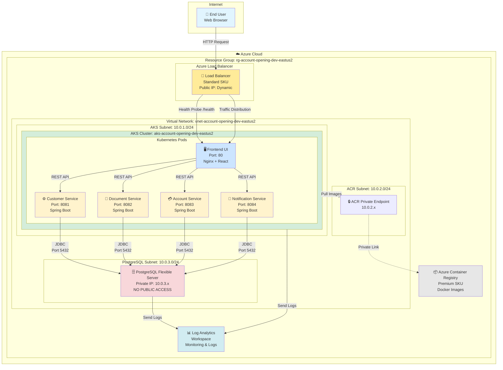
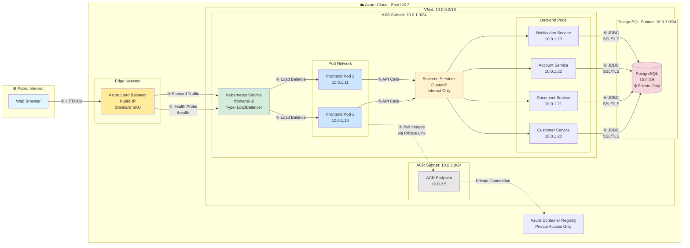
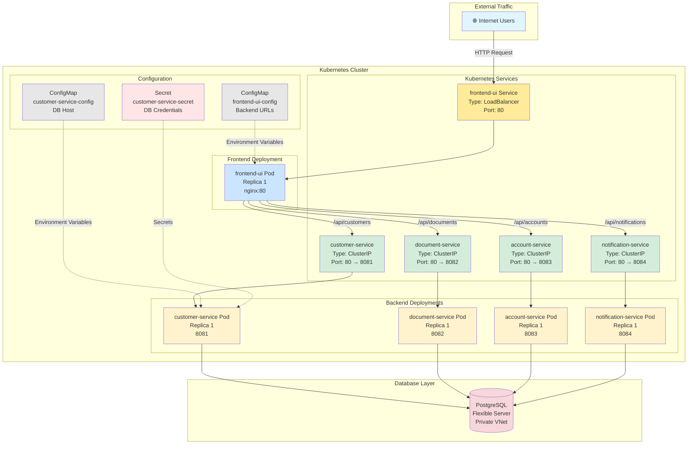
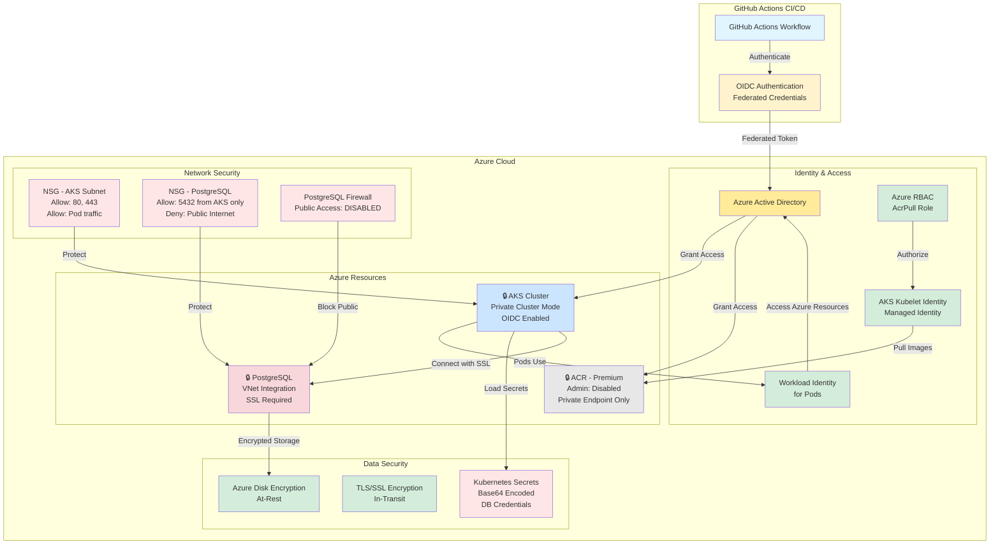
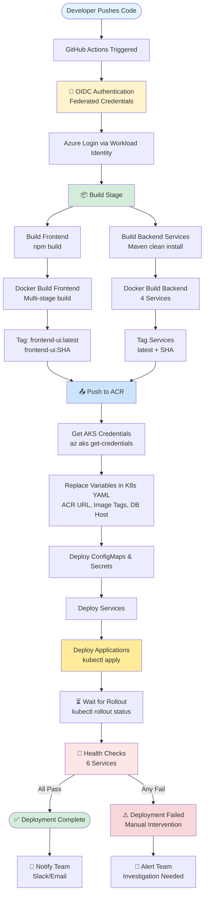

# Technology Deep Dive

This document provides detailed technical information about the application architecture, infrastructure components, and technology stack.

## Table of Contents
- [Azure Architecture Diagrams](#azure-architecture-diagrams)
- [Application Layer](#application-layer)
- [Infrastructure Layer](#infrastructure-layer)
- [Network Architecture](#network-architecture)
- [Database Layer](#database-layer)
- [Load Balancer](#load-balancer)

---

## Azure Architecture Diagrams

### High-Level Azure Architecture



### Network Flow Diagram



### Kubernetes Service Mesh



### Security Architecture



### CI/CD Pipeline Flow



---

## Application Layer

### Frontend - React 19.x

- **Framework:** React with functional components and hooks
- **State Management:** React Context API
- **Routing:** React Router v7
- **HTTP Client:** Axios with interceptors
- **UI Components:** Custom components with responsive design
- **Build Tool:** Create React App / Vite
- **Web Server:** Nginx (production)
- **Container:** Docker multi-stage build (node:18 → nginx:alpine)

**Key Files:**
- `frontend/account-opening-ui/src/App.js` - Main application component
- `frontend/account-opening-ui/nginx.conf` - Nginx configuration with API proxy
- `frontend/account-opening-ui/Dockerfile` - Multi-stage Docker build

### Backend - Spring Boot 3.x

- **Framework:** Spring Boot 3.x with Java 17
- **Architecture Pattern:** Microservices (one database per service)
- **API Style:** RESTful JSON APIs
- **Database Access:** Spring Data JPA with Hibernate
- **Schema Management:** Liquibase for database migrations
- **Health Checks:** Spring Boot Actuator (/actuator/health)
- **Configuration:** External configuration via ConfigMaps and Secrets
- **Container Base:** eclipse-temurin:17-jre-alpine

**Dependencies:**
```xml
• spring-boot-starter-web       - REST API
• spring-boot-starter-data-jpa  - Database access
• spring-boot-starter-actuator  - Health checks
• liquibase-core                - Schema migrations
• postgresql                    - PostgreSQL driver
```

---

## Infrastructure Layer

### Azure Kubernetes Service (AKS)

**Cluster Configuration:**
- **Kubernetes Version:** 1.28+
- **Network Plugin:** Azure CNI
- **Network Policy:** Azure Network Policy
- **Load Balancer:** Standard SKU (Layer 4)
- **Node Pool:** System node pool (Standard_B2s, 1 node)
- **Scaling:** Manual scale (can be changed to auto-scale)
- **Availability:** Single zone (dev), multi-zone (prod recommended)

**Why AKS?**
- ✅ Managed Kubernetes (control plane managed by Azure)
- ✅ Built-in monitoring (Container Insights)
- ✅ Azure Active Directory integration
- ✅ Automatic security updates
- ✅ Horizontal Pod Autoscaler support
- ✅ Integration with ACR, Key Vault, Private Link

**Resource Definitions:**
- **Deployments:** Define desired pod state, rolling updates
- **Services:** ClusterIP for backend, LoadBalancer for frontend
- **ConfigMaps:** Non-sensitive configuration (DB names, URLs)
- **Secrets:** Sensitive data (DB passwords) - base64 encoded
- **Ingress:** Not used (LoadBalancer direct access)

### Azure Container Registry (ACR)

- **SKU:** Basic (sufficient for dev, upgrade to Standard for prod)
- **Purpose:** Store Docker images for all microservices
- **Integration:** AKS pulls images via managed identity (no secrets)
- **Image Tagging:** Git SHA + latest tag
- **Security:** Private registry, role-based access

**Images Stored:**
```
acr<uniqueid>.azurecr.io/customer-service:latest
acr<uniqueid>.azurecr.io/document-service:latest
acr<uniqueid>.azurecr.io/account-service:latest
acr<uniqueid>.azurecr.io/notification-service:latest
acr<uniqueid>.azurecr.io/frontend-ui:latest
```

---

## Network Architecture

### Virtual Network (VNet) Design

```
VNet: 10.0.0.0/16 (65,536 IP addresses)

├── AKS Subnet: 10.0.1.0/24 (256 IPs)
│   └── Purpose: AKS nodes and pods
│       • Node IPs: 10.0.1.4, 10.0.1.5, etc.
│       • Pod IPs: Dynamically assigned from range
│       • Network Policy: Enabled for pod-to-pod security
│
├── ACR Subnet: 10.0.2.0/24 (256 IPs)
│   └── Purpose: Azure Container Registry private endpoint
│       • Private IP: 10.0.2.x
│       • No public access to ACR
│
└── PostgreSQL Subnet: 10.0.3.0/24 (256 IPs)
    └── Purpose: PostgreSQL Flexible Server
        • Delegated to: Microsoft.DBforPostgreSQL/flexibleServers
        • Private IP: 10.0.3.x
        • NO PUBLIC ACCESS ✅
```

### Network Security Groups (NSG)

**AKS Subnet NSG:**
- Allow: Inbound 443 (HTTPS) from Internet to LoadBalancer
- Allow: Inbound 80 (HTTP) from Internet to LoadBalancer
- Allow: Pod-to-Pod communication within AKS
- Allow: AKS → PostgreSQL on port 5432
- Deny: All other inbound traffic

**PostgreSQL Subnet NSG:**
- Allow: Inbound 5432 from AKS Subnet only
- Deny: All other inbound traffic (including Internet)

### Private DNS Integration

**Private DNS Zone:** `privatelink.postgres.database.azure.com`

- **Purpose:** Resolve PostgreSQL FQDN to private IP
- **Linked to:** VNet (automatic registration disabled)
- **How it works:**
  1. App tries to connect to `psql-account-opening-dev-eus2.postgres.database.azure.com`
  2. Private DNS resolves to `10.0.3.x` (private IP)
  3. Traffic stays within VNet (never goes to Internet)
  4. Connection uses PostgreSQL native SSL/TLS

---

## Database Layer

### PostgreSQL Flexible Server

**Configuration:**
- **Version:** PostgreSQL 15
- **SKU:** Burstable B1ms (1 vCore, 2 GB RAM)
- **Storage:** 32 GB with auto-grow
- **Backup:** 7-day retention, geo-redundant
- **High Availability:** Zone-redundant (optional, not enabled in dev)
- **SSL/TLS:** Required (enforced)

**VNet Integration:**
- **Subnet Delegation:** Required for PostgreSQL Flexible Server
- **Private IP:** Static IP from PostgreSQL subnet
- **Public Access:** DISABLED (enforce_ssl = true anyway)
- **Firewall:** No firewall rules needed (private-only)

**Connection String (from AKS pods):**
```
jdbc:postgresql://psql-account-opening-dev-eus2.postgres.database.azure.com:5432/customerdb
User: psqladmin
Password: <from Kubernetes Secret>
SSL Mode: require
```

**Why PostgreSQL Flexible Server?**
- ✅ Better price/performance than Single Server
- ✅ Zone-redundant HA available
- ✅ Maintenance windows (you control when updates happen)
- ✅ Stop/Start capability (saves money)
- ✅ Read replicas support
- ✅ VNet integration built-in

### Liquibase Database Migrations

Each service manages its own database schema:

**Migration Files Location:**
```
customer-service/src/main/resources/db/changelog/
├── db.changelog-master.xml
└── changes/
    ├── 001-create-customer-table.sql
    ├── 002-add-customer-indexes.sql
    └── 003-add-audit-columns.sql
```

**How it works:**
1. Service starts up
2. Liquibase checks `databasechangelog` table
3. Runs any new migrations not yet applied
4. Marks migrations as complete
5. Service starts accepting traffic

---

## Load Balancer

### Azure Load Balancer (Standard SKU)

**How Load Balancer Works:**

```
Internet Traffic
      │
      ▼
┌─────────────────────────────────────┐
│  Azure Load Balancer (Standard)     │
│  Public IP: 68.220.25.83 (example)  │
│  Type: Layer 4 (TCP/UDP)            │
└─────────────────┬───────────────────┘
                  │
                  │ Health Probe: /health every 5s
                  ▼
┌─────────────────────────────────────┐
│  Kubernetes Service: frontend-ui    │
│  Type: LoadBalancer                 │
│  Port: 80                           │
└─────────────────┬───────────────────┘
                  │
          ┌───────┴────────┐
          ▼                ▼
┌──────────────┐   ┌──────────────┐
│ Frontend Pod │   │ Frontend Pod │
│ IP: 10.0.1.x │   │ IP: 10.0.1.y │
└──────────────┘   └──────────────┘
```

**Key Characteristics:**
- **Type:** Standard SKU (regional, zone-redundant)
- **Protocol:** TCP (HTTP/HTTPS)
- **Ports:** 80 (HTTP)
- **Health Probe:** HTTP GET /health every 5 seconds
- **Distribution:** 5-tuple hash (source IP, source port, dest IP, dest port, protocol)
- **Session Persistence:** None (stateless apps)
- **Cost:** ~$20/month (regardless of traffic)

**Traffic Flow:**
1. **User Request:** Browser → `http://68.220.25.83`
2. **Load Balancer:** Receives request, health check passes → forward to pod
3. **Pod Selection:** Kubernetes service selects healthy pod (round-robin)
4. **Response:** Pod → Load Balancer → User

**Why Standard Load Balancer?**
- ✅ Zone redundancy (high availability)
- ✅ More health probe options
- ✅ Support for more backend instances
- ✅ Outbound rules (NAT)
- ✅ Better metrics and diagnostics

**IP Assignment:**
- **Static vs Dynamic:** Default is dynamic, but IP rarely changes
- **How to get IP:** `kubectl get service frontend-ui -o jsonpath='{.status.loadBalancer.ingress[0].ip}'`
- **DNS:** Can create Azure DNS A record pointing to Load Balancer IP

---

## Component Services

### Service Details

| Service | Port | Health Check | Database |
|---------|------|--------------|----------|
| Customer Service | 8081 | /actuator/health | customerdb |
| Document Service | 8082 | /actuator/health | documentdb |
| Account Service | 8083 | /actuator/health | accountdb |
| Notification Service | 8084 | /actuator/health | notificationdb |
| Frontend UI | 80 | /health | N/A |
| PostgreSQL | 5432 | TCP check | Private only |

---

**See Also:**
- [Deployment Guide](DEPLOYMENT_GUIDE.md)
- [Testing Guide](TESTING_GUIDE.md)
- [Troubleshooting Guide](TROUBLESHOOTING.md)
